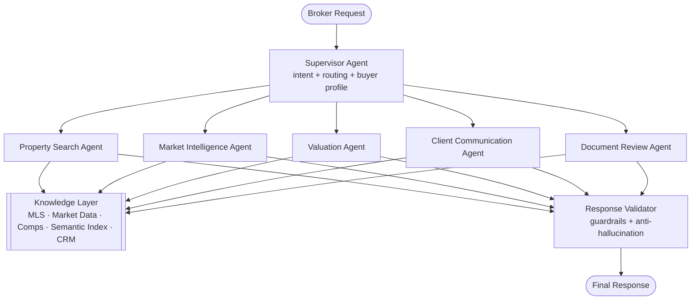
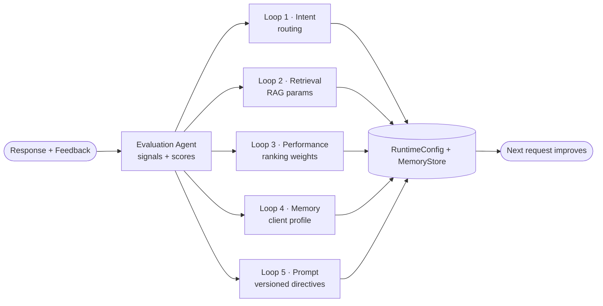

# Agentic Real Estate — Orchestrator & Loop Engine

A runnable reference implementation of a **Real Estate AI Agent Orchestrator**
(Phase 1) that evolves into a **self-improving Loop Engineering system** (Phase 2).

> The shift this codebase demonstrates: **"I build agents" → "I build
> self-improving AI systems."**

> Architecture & diagrams: [docs/architecture.md](docs/architecture.md)

It runs **fully offline** by default. Every numeric result (ranking, valuation,
market scoring, KPIs) is computed deterministically; an LLM is used only to
*polish* narrative text and is mocked unless you configure a provider. That
keeps the system testable and free of fabrication.

---

## Quickstart

```powershell
# 1. (optional) create a venv, then install deps
pip install -r requirements.txt

# 2. Phase 1 — multi-agent orchestrator answering a broker request
python examples/run_phase1.py

# 3. Phase 2 — the five improvement loops adapting the system live
python examples/run_phase2_loops.py

# 4. Capstone — a simulated multi-turn 'broker day' (Phase 1 + Phase 2 + KPIs)
python examples/run_broker_session.py

# 5. Interactive CLI — drive the whole loop from your terminal (zero install)
python realestate.py

# 6. Web UI — a small browser front end + JSON API (stdlib only, no extra deps)
python serve.py        # then open http://127.0.0.1:8000

# 7. Run the test suite (45 tests)
python -m pytest -q
```

Using a real LLM for narrative polishing is optional — copy `.env.example` to
`.env` and set an OpenAI or Azure OpenAI key. With no key, the deterministic
mock engine is used.

```python
from real_estate_loop import RealEstateOrchestrator
from real_estate_loop.loops.evaluation import Feedback

orch = RealEstateOrchestrator()
response, report = orch.process(
    "Find me a $700k house near Seattle with good investment potential",
    client_id="client-emma",
    feedback=Feedback(clicked=True, comment="a couple look too expensive"),
)
print(response.executive_summary)
for change in report.all_changes():
    print(change)
```

### Interactive CLI

Run `python realestate.py` (or `python -m real_estate_loop`, or `realestate`
after `pip install -e .`) for a broker REPL where each request is answered and
each `:feedback` teaches the loops:

```text
broker> Find me a $700k investment house near Seattle
broker> :feedback too expensive, but I clicked MLS-1013   # the loops adapt
broker> :learned        # what changed: routing, ranking weights, memory
broker> :kpis           # conversion rate, hallucination rate, latency, tokens
broker> :quit
```

**Learning persists across restarts.** The CLI loads a state file on start and
saves after every command, so adapted routing, ranking weights, prompt versions,
and client memory survive between sessions. Use `:save` to persist on demand,
`:reset` to return to factory defaults, `--state <path>` to choose the file
(default `.realestate_state.json`), or `--no-persist` to disable. From Python,
`orchestrator.save_state(path)` / `load_state(path)` / `reset_state()` do the same.

### Web UI

Run `python serve.py` (or `python -m real_estate_loop.web`, or `realestate-web`
after `pip install -e .`) and open <http://127.0.0.1:8000>. It serves a small
single-page app plus a JSON API — **stdlib `http.server` only, no extra deps**:

| Route | Purpose |
|---|---|
| `POST /api/handle` | answer a broker request (Phase 1) |
| `POST /api/feedback` | teach the loops from the outcome (Phase 2) |
| `GET /api/kpis` | telemetry / business KPIs |
| `GET /api/learned` | current routing, weights, retrieval, changelog, profiles |
| `POST /api/reset` | reset learned state to defaults |

The page lets a broker type a request, mark which listings the client liked,
send feedback, and watch the KPIs and “what it learned” panels update live. The
server persists learned state with the same `--state` / `--no-persist` flags as
the CLI.

---

## Phase 1 — Multi-Agent Architecture



Every agent emits a structured `AgentMessage` and a typed result that mirrors
the contracts in the system spec:

| Agent | Responsibility | Output schema |
|---|---|---|
| `SupervisorAgent` | Detect intent, build the buyer profile, choose the agent set | `SupervisorPlan` |
| `PropertySearchAgent` | Search, filter, rank (40% requirements / 30% location / 20% investment / 10% timing) | `list[PropertyMatch]` |
| `MarketIntelligenceAgent` | Neighborhood trends, appreciation, investment score 0–100, risks | `MarketSummary` |
| `ValuationAgent` | Comp-based value range, over/under-pricing, negotiation range | `Valuation` |
| `ClientCommunicationAgent` | Professional, non-pressuring client messages | `CommunicationOutput` |
| `DocumentReviewAgent` | Extract key terms, flag risks, route attorney items (not legal advice) | `DocumentReview` |
| `ResponseValidator` | Quality gate: guardrails + verify every listing id is real | `ValidationResult` |

### Memory system
- **Short-term** — rolling conversation buffer per session (`ShortTermMemory`).
- **Long-term CRM** — `ClientProfile` (learned, confidence-scored) + `BrokerMemory`
  (active listings, pipeline, sales history).
- **Semantic** — dependency-free TF-IDF index (`SemanticIndex`) over listings.

### Guardrails
Never fabricate listings, invent data, give legal advice, or guarantee returns.
Enforced two ways: deterministic text scans (legal-advice / guarantee phrasing)
and an **anti-hallucination backstop** — the validator drops any recommendation
whose listing id is not in the data sources. When criteria are missing the
system returns the spec's `uncertain` contract instead of guessing.

---

## Phase 2 — Loop Engineering

After each response (and any feedback), the **Loop Engine** runs an Evaluation
Agent followed by five improvement loops that mutate shared runtime state, so the
*next* request is already better.



| Loop | Reads (signals) | Changes |
|---|---|---|
| **1 Intent Optimization** | `missing_market_analysis`, `missing_valuation` | Expands the routing table (e.g. *investment* → adds Market + Valuation) |
| **2 Retrieval Improvement** | `weak_retrieval`, low relevance | Raises `top_k`, enables rerank, enriches indexed metadata, bumps version |
| **3 Agent Performance** | `ranking_mismatch_price/cheap`, low agent quality | Retunes Property Search ranking weights |
| **4 Memory Evolution** | clicked / ignored listings | Builds a confidence-scored `ClientProfile` (likes, dislikes, locations) |
| **5 Self-Improvement** | `weak_retrieval`, `low_match_accuracy`, low scores | Adds versioned prompt directives (Generate→Execute→Observe→Evaluate→Modify) |

Run `examples/run_phase2_loops.py` to watch a naive system start with
`investment → [PropertySearchAgent]`, get feedback, and **learn** to route to
`[PropertySearchAgent, MarketIntelligenceAgent, ValuationAgent]` while
reweighting ranking, evolving the client profile, widening retrieval, and
versioning its prompt — all logged in `config.changelog`.

### Observability / KPIs
`MetricsCollector` tracks the signals named in the spec: latency, token cost,
agent success rate, hallucination rate, conversion rate, per-agent quality, and
tool-usage efficiency. See the `OBSERVABILITY` block printed by the examples.

---

## Project structure

```
src/real_estate_loop/
  core/        schemas · runtime config · LLM client · guardrails
  knowledge/   data sources (MLS/market/comps) · semantic index
  memory/      short-term · client CRM · broker memory
  telemetry/   metrics / observability
  agents/      supervisor · 5 specialized agents · response validator
  loops/       evaluation agent · 5 loops · loop engine
  orchestrator.py   top-level system (handle / improve / process)
  cli.py · __main__.py   interactive broker REPL
  web/         JSON API router + stdlib HTTP server + static SPA
  persistence.py    save/load/reset learned state (config + memory)
data/          synthetic SAMPLE listings (30), market data, comparables
docs/          architecture.md (diagrams)
examples/      run_phase1.py · run_phase2_loops.py · run_broker_session.py
realestate.py · serve.py   zero-install CLI and web launchers
tests/         45 tests across agents, orchestrator, loops, CLI, persistence, web, data
```

---

## Mapping to a production stack

This repo keeps dependencies to `pydantic` so it is easy to read and run. Each
layer is a drop-in seam for the enterprise components named in the spec:

| Concern | Reference impl here | Production swap |
|---|---|---|
| Orchestration | `Supervisor` + `LoopEngine` | LangGraph · Microsoft Agent Framework · Temporal |
| Short-term memory | `ShortTermMemory` | Redis |
| Client/broker memory | `MemoryStore` | PostgreSQL · Neo4j (relationships) |
| Knowledge / RAG | `SemanticIndex` + `DataSources` | Azure AI Search · Qdrant · Pinecone |
| Data sources | bundled `data/*.json` | MLS / Zillow / Redfin APIs |
| Evaluation | `EvaluationAgent` + signals | LangSmith · custom eval pipeline |
| Observability | `MetricsCollector` | OpenTelemetry |
| LLM | `LLMClient` (mock/OpenAI/Azure) | any provider |

To go live, the main change is replacing the read methods in
`knowledge/data_sources.py` with real API clients — the agents are unaware of
the data origin.

---

## Note on data

All listings, market figures, and comparables in `data/` are **synthetic and
clearly labeled** (`source: SAMPLE_DATASET`). They exist only to exercise the
pipeline. The anti-hallucination guardrail treats this set as the single source
of truth, so the system will never invent listings beyond it.
