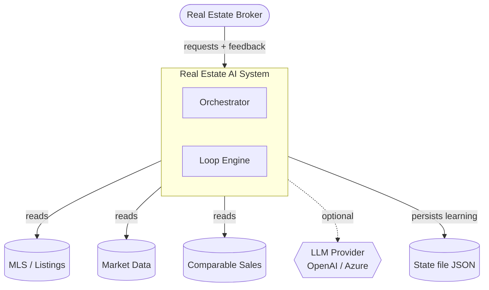
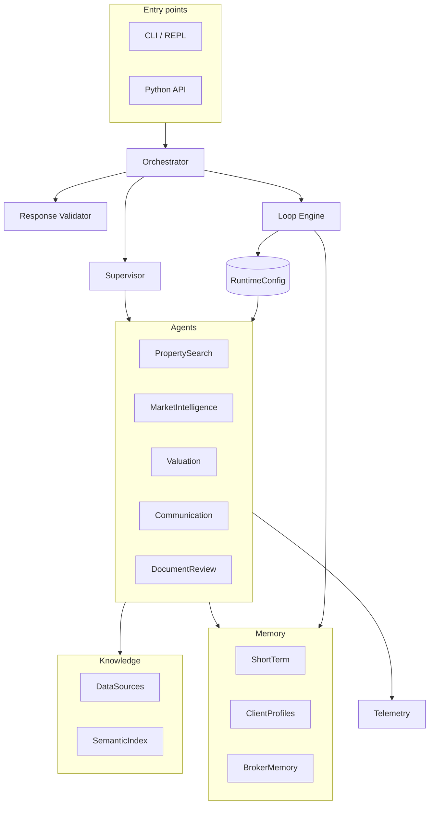
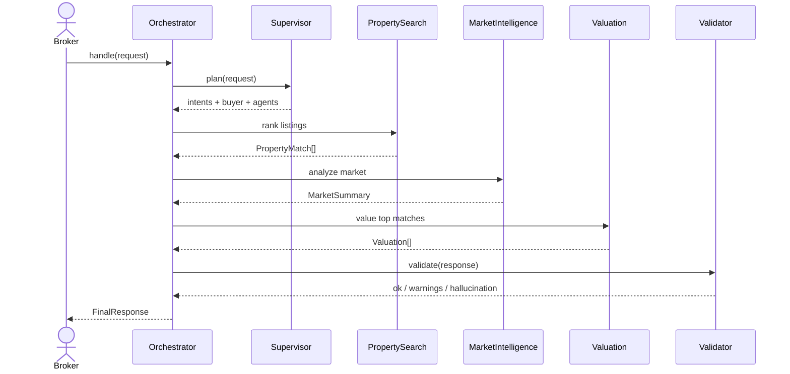
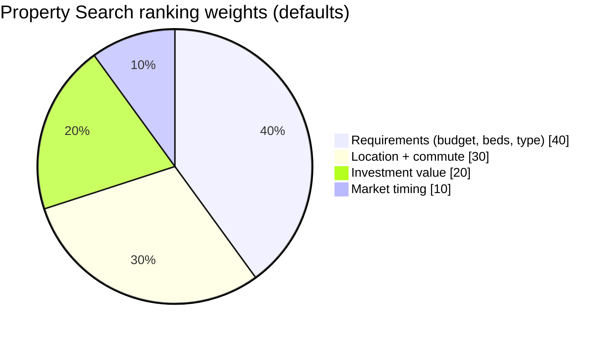
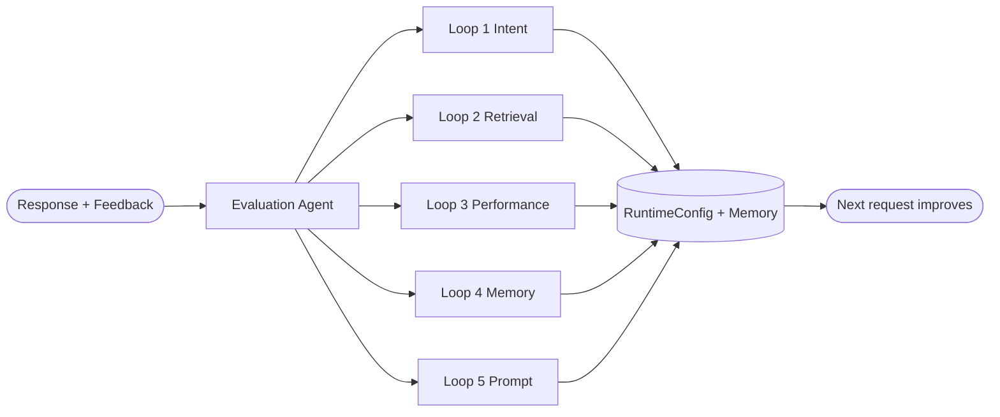
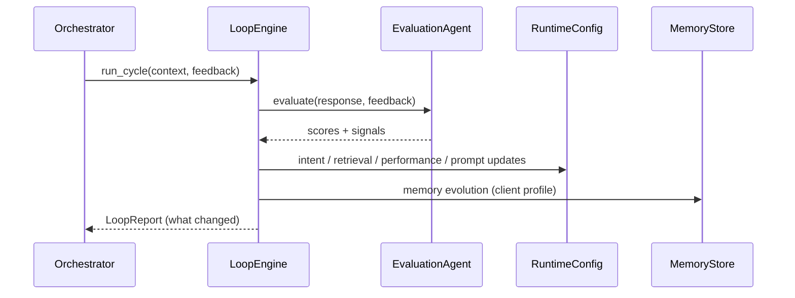
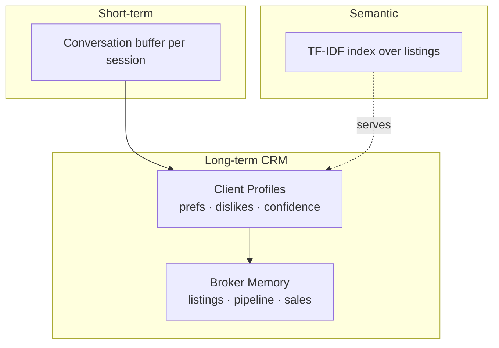
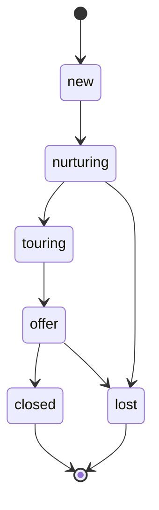
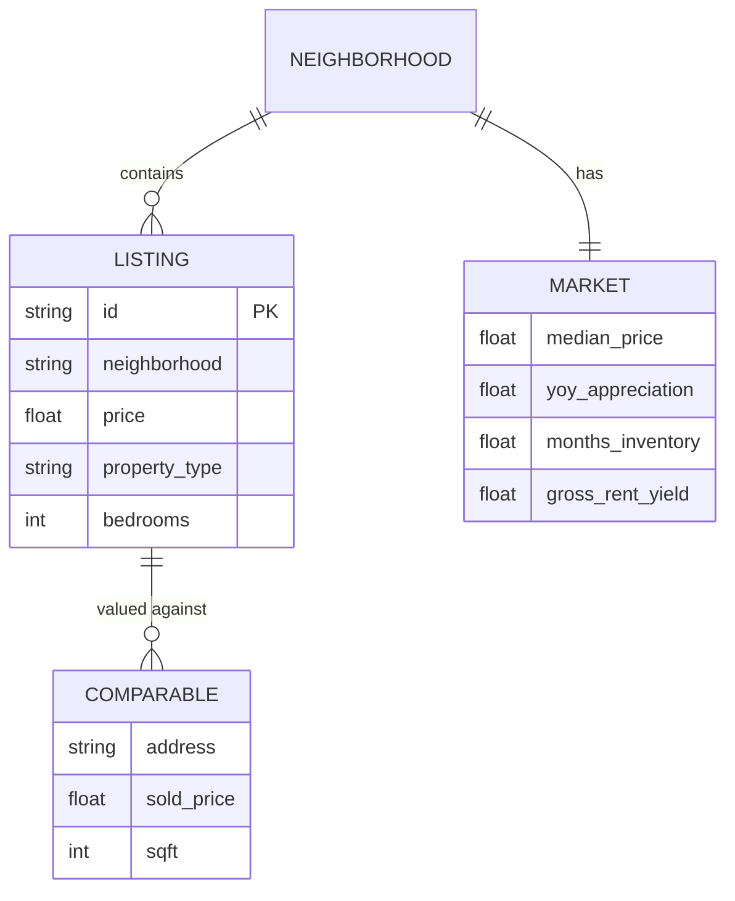
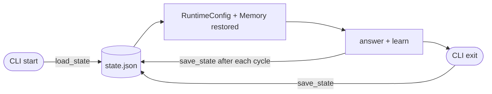

# Architecture

This document explains how the **Real Estate AI Agent Orchestrator** (Phase 1)
and the **Loop Engine** (Phase 2) fit together, with diagrams for the system
context, components, request lifecycle, the five improvement loops, memory,
and state persistence.

> All diagrams are Mermaid and render on GitHub and in VS Code.

---

## 1. System context

A broker interacts with one system that reads from real-estate data sources,
optionally calls an LLM to polish narrative text, and persists what it learns.

The data sources are the **single source of truth**. The anti-hallucination
guardrail only permits the system to reference listing ids that exist there.

---

## 2. Components

The codebase is layered. Agents read from the knowledge and memory layers and
emit telemetry; the Loop Engine writes to the shared `RuntimeConfig` and
`MemoryStore` that the agents read on the next request.

| Layer | Module | Responsibility |
|---|---|---|
| Core | `core/` | schemas, `RuntimeConfig`, LLM client, guardrails |
| Knowledge | `knowledge/` | data sources (MLS/market/comps), TF-IDF semantic index |
| Memory | `memory/` | short-term buffer, client CRM profiles, broker memory |
| Telemetry | `telemetry/` | latency, tokens, success/hallucination/conversion rates |
| Agents | `agents/` | supervisor, 5 specialized agents, response validator |
| Loops | `loops/` | evaluation agent, 5 loops, loop engine |
| Entry | `orchestrator.py`, `cli.py` | `handle` / `improve` / `process`, REPL |

---

## 3. Phase 1 — request lifecycle

`orchestrator.handle()` plans the work, runs the needed agents in a sensible
order, then passes everything through the validator before responding.

Which agents run is decided by the **routing table** in `RuntimeConfig`, keyed
by detected intent. The Property Search ranking is a weighted blend:

These weights live in config so Loop 3 can retune them from feedback.

---

## 4. Phase 2 — Loop Engineering

After each response (and any feedback) the Loop Engine evaluates the outcome
and runs five loops that adapt the shared state, so the **next** request is
already better.

| Loop | Reads (signals) | Writes |
|---|---|---|
| 1 Intent | `missing_market_analysis`, `missing_valuation` | routing table |
| 2 Retrieval | `weak_retrieval`, low relevance | `top_k`, rerank, metadata, version |
| 3 Performance | `ranking_mismatch_*`, low quality | ranking weights |
| 4 Memory | clicked / ignored listings | client profile (likes, dislikes, confidence) |
| 5 Prompt | `weak_retrieval`, `low_match_accuracy` | versioned prompt directives |

---

## 5. Memory tiers

A client moves through the broker pipeline as deals progress:

---

## 6. Data model

---

## 7. State persistence

The CLI persists the **learned** state (config knobs + memory) to a JSON file
and restores it on startup, so adaptations survive restarts. Ephemeral
short-term conversation buffers are intentionally not persisted.

What is persisted:

- **Config**: ranking weights, routing table, retrieval config, prompt
  versions, and the change log.
- **Memory**: client profiles (preferences, dislikes, behavior signals,
  confidence) and broker memory (active listings, pipeline, sales history).

On load, the semantic index is rebuilt to match the restored retrieval metadata
fields.

---

## See also

- [README.md](../README.md) — quickstart, agent contracts, production-stack mapping
- `src/real_estate_loop/orchestrator.py` — top-level wiring
- `src/real_estate_loop/loops/loop_engine.py` — the five loops in order
